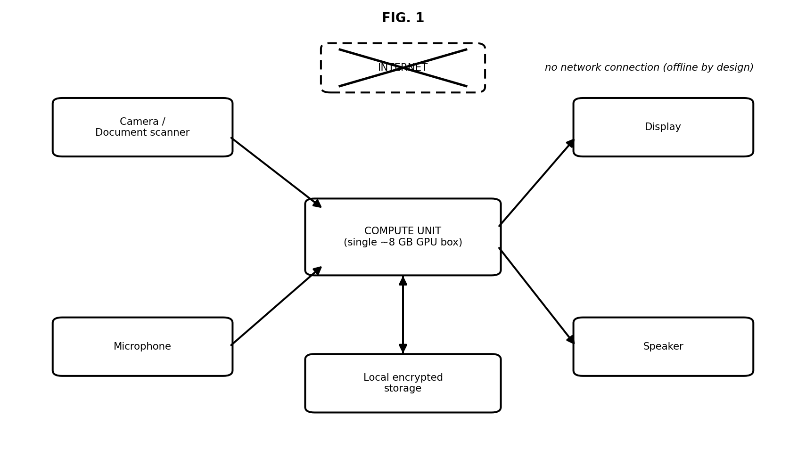
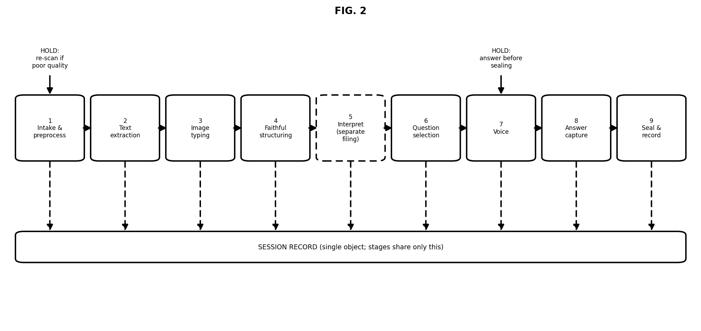
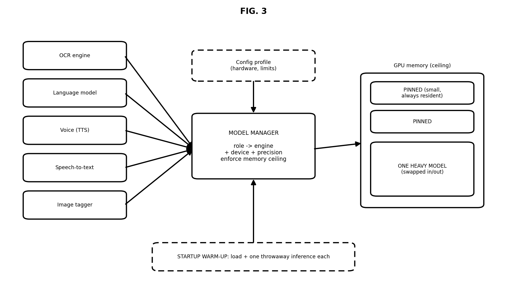
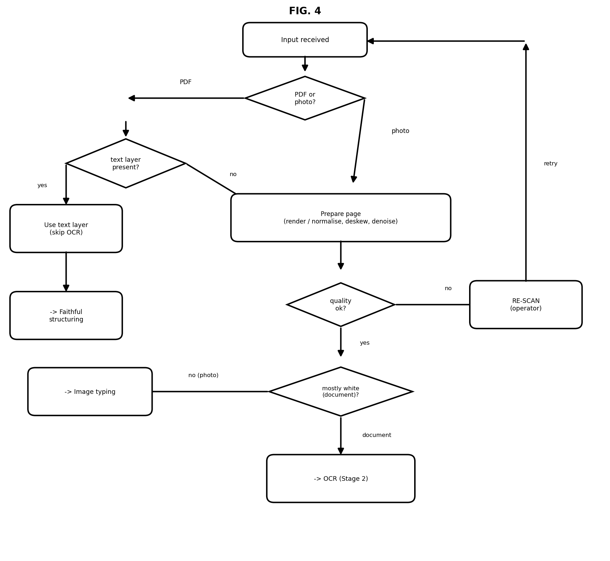
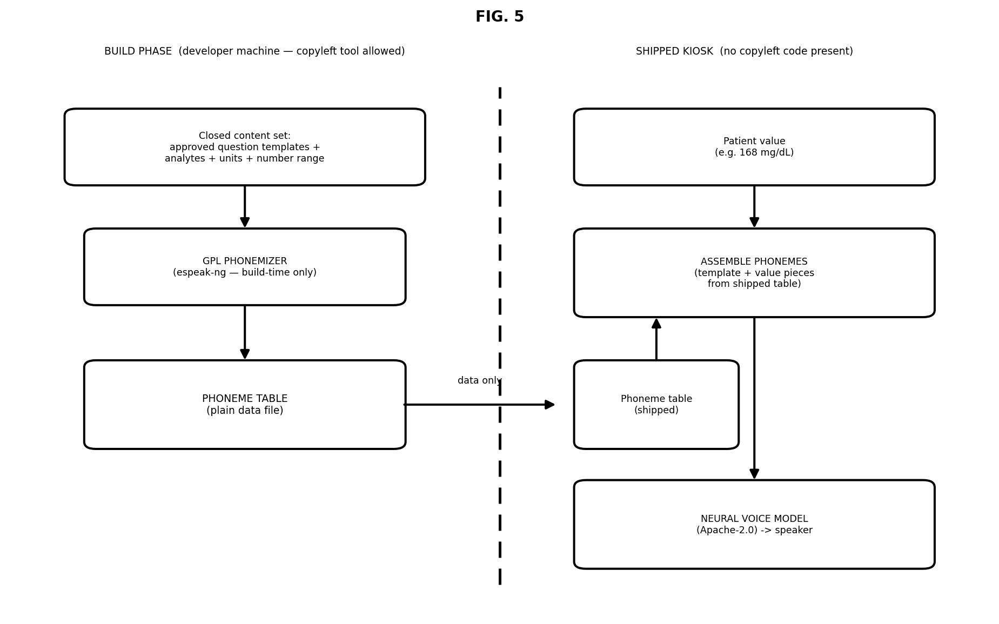

# Invention Disclosure Draft
*(Technical disclosure for patent counsel — not legal advice)*

**Scope note (put at top of the form):** This filing covers *capture → extraction → faithful structuring → multilingual voice intake → sealed record*, running fully offline on one small device. The clinical interpretation engine (reference ranges, abnormal flagging) is intended as a **separate filing** — it needs clinician-validated ranges first, and keeping it out makes this filing cleaner.

**Figures:** Each figure is provided as a labelled set and a clean (unlabelled) set under `_patent_figures/`.

| Fig | Labelled | Clean (no text/numbers for second set as required) |
|-----|----------|-----------------------------------------------------|
| 1 System | `fig1_system_labeled.png` | `fig1_system_clean.png` |
| 2 Pipeline | `fig2_pipeline_labeled.png` | `fig2_pipeline_clean.png` |
| 3 Model manager | `fig3_modelmgr_labeled.png` | `fig3_modelmgr_clean.png` |
| 4 Intake flow | `fig4_intake_labeled.png` | `fig4_intake_clean.png` |
| 5 Voice precompute | `fig5_voice_precompute_labeled.png` | `fig5_voice_precompute_clean.png` |

---

## (a) What led you to create this invention / what are the problems intended to be solved by invention?

A patient in an Indian primary health centre gets a printed lab report and almost no explanation. The report is in English, uses abbreviations, and the consultation lasts a couple of minutes. Meanwhile the health worker has to re-type values into a register by hand.

The specific problems:

1. **Paper is a dead end.** Values printed on paper cannot be searched, tracked or acted on until a human copies them out, and manual copying introduces errors.
2. **Language gap.** The report is English; the patient speaks Hindi or a regional language. Translation depends on whoever is standing there.
3. **No connectivity.** PHCs and camps often have no reliable internet, so cloud AI services are unusable exactly where the need is greatest.
4. **Privacy and cost.** Sending a patient's report photograph to a cloud service creates a data-protection exposure and a per-page cost that does not scale to a public health programme.
5. **Generative AI is unsafe as-is.** A language model summarising a report can invent values that were never on the page. It can also silently drop values that were. Both are clinically dangerous and neither is visible to the user.
6. **Free-form AI chat cannot be certified.** If the system may say anything to a patient, no clinician will sign off on it and no regulator will approve it.
7. **Small hardware, many models.** Doing this properly needs OCR, a language model, speech-to-text and text-to-speech. On an 8 GB device they cannot all sit in memory at once, and naive loading made our own voice step take **131 seconds per patient** — unusable at a counter with a queue.
8. **No evidentiary trail.** If a digital record is produced later, there is no proof of which source image and which software version produced it.
9. **Voice licensing trap.** High-quality Hindi voices that look “free” are often non-commercial-only, or depend on a copyleft phonemizer that would infect a shipped product if bundled at run time.

---

## (b) Current technologies / products / processes that provide solution(s) for the same problem(s)

| Category | Examples | What they do |
|---|---|---|
| Cloud document AI | Google Document AI, AWS Textract, Azure Form Recognizer | Extract text/tables from documents via API |
| Cloud medical AI | Generic LLM APIs used for report summarisation | Summarise or explain a report |
| Health kiosks / “health ATMs” | Yolo Health, Clinics on Cloud, similar Indian vendors | Bundle vitals devices with a screen; typically cloud-backed |
| Indian AI-health point solutions | Qure.ai (radiology), SigTuple (microscopy), Tricog (ECG) | Single-modality AI, mostly cloud or semi-connected |
| Symptom checkers | Ada, Infermedica and similar | Free-form or decision-tree symptom questioning |
| Speech stacks | Google Cloud STT/TTS, Bhashini, AI4Bharat models | Indian-language speech, mostly cloud APIs |
| Status quo | Manual register entry + verbal explanation by staff | The actual baseline in most PHCs |

*Verify the specifics of each competitor’s current offering before filing — vendor capabilities change and the examiner will check.*

---

## (c) How does invention address / improve on the drawbacks and deficiencies of available solutions?

| Deficiency in existing solutions | What this invention does |
|---|---|
| Needs internet | Runs **fully offline** on one box. The environment profile declares “no internet”, and the software then forces its AI libraries into offline mode so no component can silently reach out to the network. |
| Patient data leaves the premises | Nothing leaves the device. Session artifacts are auto-deleted after a set idle period. |
| Per-page cloud cost | Zero marginal cost per patient after the hardware. |
| AI may invent values | A **faithfulness check** compares the generated summary against the extracted text and rejects anything not supported by the source. |
| AI may lose values | Extraction output is treated as the **floor**: the AI may enrich the record but cannot remove a measured value from it. |
| AI may say anything to a patient | The system can only speak **pre-approved, pre-translated questions** from a doctor-signed bank. It chooses which to ask; it never writes one. |
| Too slow / unpredictable on small hardware | A model-residency policy distinguishes small always-needed models (kept loaded) from large ones (loaded one at a time), and all first-use initialisation is moved to device startup. Our voice step went from **131 s to under ~2 s** on the same laptop (measured). |
| Wrong tool for the job | Typing an image is done by a ~200 MB image classifier instead of a ~3.7 GB vision-language model — about **0.05 s instead of 13 s**, with a reject class so junk input is refused rather than forced into a category. |
| Locked to one AI vendor | Every model is behind an interchangeable adapter chosen by a config file, so swapping OCR or the language model is a config edit, not a code change. |
| No proof of provenance | Every source file is hashed and the final record is sealed with a **SHA-256** stamp plus a version number. |
| Licensing landmines | Voice engines were selected so both the software *and* the voice data are commercially usable. Where a high-quality phonemizer is copyleft (GPL), it is used **only at build time** to produce a plain phoneme table; only that table ships on the kiosk (**Fig. 5**). |

---

## (d) Brief abstract of the Invention

A self-contained point-of-care device that turns a printed laboratory report into a structured, verifiable digital record and conducts a short spoken patient interview in the patient’s own language, entirely without internet access.

The device photographs or ingests the report, cleans and quality-checks each page, decides whether the page is a document or a clinical photograph, reads printed values using on-device optical character recognition (or lifts the embedded text layer directly when the input is a digital PDF), and produces a structured summary using an on-device language model whose output is checked against the source so that nothing is invented and nothing measured is lost.

It then selects a small number of intake questions from a clinician-approved question bank, fills in patient-specific values from the extracted data only, speaks them aloud in the patient’s language (using a commercially clean neural voice; for Indic, phonemes for the closed question vocabulary may be precomputed at build time and assembled at run time), captures spoken answers using on-device speech recognition with a language-verification safeguard, and seals the whole session — source hashes, extracted values, questions, answers, and software/model versions — into a versioned, integrity-stamped record.

All models run on one small computer under a residency policy that keeps latency low and bounded, and every model choice is a configuration entry rather than hard-coded, so components can be replaced without altering the system.

---

## (e) 3–4 relevant keywords related to invention

1. Offline edge AI medical kiosk  
2. Laboratory report digitisation and structuring  
3. Closed-vocabulary multilingual voice intake  
4. Verifiable AI clinical record (faithfulness and provenance)

---

## (f) Novel Features of invention

1. **Closed-vocabulary patient questioning.** The set of sentences the machine can utter to a patient is finite, clinician-signed and pre-translated. The AI selects and fills slots; it never composes. This makes the safety guarantee *structural* rather than statistical, and adding a language does not widen the risk surface because no free-form text is generated at run time.

2. **Two-sided guard on the generated summary.** One check ensures nothing was invented (every claim traceable to extracted text). A second mechanism ensures nothing was lost (extraction output is the irreducible floor). Existing “hallucination checks” address only the first.

3. **Bounded-latency multi-model residency policy.** Models are classed as *pinned* (small, always needed, never evicted) or *heavy* (large, loaded one at a time). Pinned models count against the memory ceiling but not against the “how many big models may be resident” limit — that distinction is what makes the policy safe rather than merely permissive. Combined with a startup hook that performs one throwaway inference per model, per-patient latency becomes predictable. (**Fig. 3**)

4. **Input routing before recognition.** Each page is classified as document or clinical photograph before OCR, and digital PDFs with a real text layer bypass the recognition engine entirely. Work is not spent recognising text that either isn’t there or is already available. (**Fig. 4**)

5. **Right-sized model per task.** Image typing uses a small classifier with an explicit reject class rather than a large vision-language model — two orders of magnitude faster and smaller, and it refuses non-clinical input instead of guessing.

6. **Language-verification safeguard on speech recognition.** The chosen Hindi speech model can output Hindi even when the speaker speaks English, and report maximum confidence while doing so — it fails silently at full confidence. A second, very small model independently verifies the spoken language and raises a mismatch for review, so engine selection never rests on the primary model’s own confidence.

7. **Config-declared hardware profiles.** One codebase adapts to a laptop, a cloud server or an ARM edge module by declaring device, memory ceiling, residency limits, precision and network permission in a profile. Behaviour including offline enforcement follows from the profile.

8. **Provenance sealing.** Source-file hashes, extracted values, question/answer pairs, and the identity and version of every model used are bound into one versioned record with a cryptographic stamp.

9. **Build-time phoneme precompute / run-time assembly (licensing-safe Hindi voice).** Because the spoken content set is closed (templates + analytes + units + number range), a copyleft phonemizer may be run on a developer machine to emit a plain phoneme table. The shipped kiosk carries only that table plus a permissively licensed neural voice; at run time it assembles phonemes for the filled template and synthesises audio. Measured quality is essentially the same as full online phonemisation, while the kiosk ships no copyleft phonemizer. (**Fig. 5**)

10. **Audio–timing seam for future avatar.** Each spoken clip is emitted with its precise duration, providing a clean attachment point for a lip-synced avatar without changing the speech stage.

11. **Commercially-clean multilingual voice selection.** Engine *and* voice-data licensing were treated as a design constraint, not an afterthought.

---

## (g) Use / Applications of invention

- **Primary health centres and pre-OPD triage** — digitise the report and complete the intake interview before the patient reaches the doctor.
- **Diagnostic laboratories** — hand the patient a spoken explanation and the clinic a structured record at the collection counter.
- **Rural and mobile health camps** — works with no connectivity at all.
- **Pharmacy and wellness kiosks** — self-service report digitisation.
- **Teleconsultation preparation** — produce a structured record before a remote consult, so scarce doctor time is not spent on data entry.
- **Public health programmes** — bulk conversion of paper results into structured records at the point of collection.
- **Home and elder care** — a family member scans a report and hears it explained in the local language.
- **Adjacent, same machinery** — discharge summaries, prescriptions, insurance claim documents, veterinary reports.

---

## (h) Alternatives to invention (if any)

Honest list — these are what someone would do instead:

1. **Manual entry plus verbal explanation.** What happens today. Slow, error-prone, and entirely dependent on staff availability.
2. **Cloud OCR plus a cloud LLM.** Technically capable, but requires connectivity, sends patient data off-site, costs per page, and offers no guarantee about invented or lost values.
3. **A phone app that uploads a photo.** Same cloud dependencies, plus it assumes patient smartphone ownership and literacy.
4. **A large multimodal model doing everything in one pass.** Simpler to build, but too slow and too large for edge hardware, and it removes the checkpoints where safety is enforced.
5. **A printed multilingual leaflet.** Cheap and safe, but generic — not tied to the patient’s actual values.
6. **A human interpreter or counsellor.** Best quality, does not scale, unavailable in most PHCs.

The invention is distinguished by being the only option that is simultaneously offline, per-patient specific, bounded in what it may say, commercially licensable for Indic voice, and evidentially sealed.

---

## HOW DOES THE INVENTION WORK

*(Processes involved and interactive actions between components — see also Figs. 1–5)*

Nine stages run in fixed order (**Fig. 2**). Each acquires its model, does its work, and releases it — except models marked pinned, which stay loaded. A single session record flows through all stages; stages communicate only through that record, never directly, which is what allows any stage or model to be replaced independently.

**Physical arrangement (**Fig. 1**).** Camera/scanner and microphone feed a single ~8 GB compute unit; display and speaker output to the operator/patient; local encrypted storage holds session artifacts. There is deliberately no network connection.

**Stage 1 — Intake and preprocessing (**Fig. 4**).** Photos and PDFs are received. PDF pages are rendered at a fixed resolution; photographs are normalised to a standard size. Each page is straightened and denoised. A quality gate measures sharpness and brightness and flags pages that must be re-scanned before anything else is attempted. A second gate measures how much of the page is near-white to decide *document* versus *clinical photograph*. A third check looks for a real embedded text layer in digital PDFs. Output: cleaned pages, each tagged with its type and whether text is already available.

**Stage 2 — Text extraction.** Pages carrying an embedded text layer pass their text forward without touching the recognition engine. Remaining document pages go through on-device OCR. Pages typed as clinical photographs are skipped. Each extracted field carries a confidence score; anything below a threshold is marked for human review rather than trusted. Results are cached against the page’s content hash and the engine configuration, so re-processing an identical page is instant and changing the engine invalidates the cache automatically.

**Stage 3 — Image typing.** Clinical photographs are classified into a small set of types by a compact classifier that includes an explicit reject class, so a scanned page or junk image is recorded as *unknown* rather than forced into a category.

**Stage 4 — Faithful structuring.** An on-device language model converts the extracted text into a structured record and a plain-language narrative. Generation is deterministic, and the output budget scales with how many values the page actually contains, so large reports are not truncated. The output is then checked against the extracted text: claims not supported by the source cause the draft to be rejected or flagged. Separately, the extraction output is retained as the floor of the record, so a value the model omitted is still present downstream.

**Stage 5 — [Interpretation: out of scope for this filing.]** Shown dashed in Fig. 2 as a placeholder for a later filing.

**Stage 6 — Question selection.** Deterministic rules run over the structured facts — which tests are present, collection dates, medications named — and select a small number of questions from the clinician-signed bank, ordered by priority. Slots inside each question template are filled from extracted data only. A validation step confirms every selected question traces to a bank entry.

**Stage 7 — Voice (**Fig. 5**).** Each selected question is spoken in the patient’s language by an on-device speech synthesiser — one path for Indic languages, another for English, both chosen at run time from the session’s language. For Indic closed-vocabulary utterances, phonemes may be looked up from a build-time table and assembled with the patient-specific value pieces, then passed to the neural voice model. Each clip is written as an audio file and recorded with its exact duration.

**Stage 8 — Answer capture.** The patient’s spoken answer is transcribed on-device. A small independent model verifies the language actually spoken matches the selected engine, and a mismatch is raised for review instead of being accepted.

**Stage 9 — Sealing and record output.** Every source file is hashed. The structured values, narrative, questions, answers, model identities and versions are assembled into a versioned record and stamped with a cryptographic digest, then persisted.

**Cross-cutting: the model manager (**Fig. 3**).** All stages request models by *role* (“the OCR engine”), never by name. A manager resolves the role to a concrete engine, device and precision from configuration for the active hardware profile; enforces the memory ceiling; releases heavy models to make room; and refuses to load rather than crashing when memory is insufficient. At device startup a warm-up routine loads each model and performs one throwaway inference, publishing a readiness signal that the interface uses to hold the start button until the machine is genuinely ready.

**Cross-cutting: offline enforcement.** When the hardware profile declares no internet, the system sets its AI libraries into offline mode at startup — before any of them are loaded — so no component can attempt a network fetch for weights it already has locally.

---

## ADVANTAGES AND IMPROVEMENTS OVER THE EXISTING PRODUCT(S) / PROCESS

**Speed and predictability**
1. Voice generation reduced from **131 s to ~0.7–1.6 s** per patient on the same hardware, with no meaningful reduction in audio quality for the closed question set (same neural voice path; precompute assembly verified by side-by-side clips).
2. Image typing about **65× faster** and roughly **18× smaller** than the vision-language alternative.
3. Whole pipeline completes in about **17 s** for a typical report (measured on the development laptop profile).
4. Latency is *bounded*, not merely fast: cold-start cost is paid once at device startup rather than by the first patient.
5. Repeat processing of an identical page is instant via content-hash caching.

**Safety**
6. The machine cannot say an unapproved sentence to a patient.
7. Invented values are rejected; measured values cannot be lost.
8. Low-confidence extractions are flagged, not silently trusted.
9. Unrecognisable images are refused rather than guessed.
10. Silent language failure in speech recognition is caught by independent verification.
11. Poor-quality captures are stopped at the door with a re-scan instruction.

**Privacy and cost**
12. No patient data leaves the device.
13. No per-patient cloud cost.
14. Session artifacts are automatically deleted after an idle period.
15. Works with zero connectivity.

**Deployability, evidence, and licensing**
16. One codebase spans laptop, server and ARM edge module by configuration.
17. Any model can be swapped without touching code — no vendor lock-in.
18. Every record is hashed, versioned and traceable to the exact software and model versions that produced it.
19. Runs on a single ~8 GB device with commodity hardware.
20. Components are selected for commercial deployment, including voice *data*; where a copyleft phonemizer is needed for quality, it stays off the shipped device (build-time table only).

---

## FINAL CAD IMAGES / LINE DIAGRAMS OF THE FINAL PROTOTYPE

*(Two sets: labelled to detail, and clean without description/legends/numbering. Include relevant flow charts.)*

### Set A — Labelled (for explanation)

**Fig. 1 — System block diagram.** Offline single-box kiosk: camera/scanner + microphone in; display + speaker out; local encrypted storage; internet deliberately absent.

**Fig. 2 — Pipeline flow.** Nine stages sharing one session record; Stage 5 (interpretation) dashed as separate filing; hold points at intake quality and before sealing.

**Fig. 3 — Model manager and residency.** Roles resolve via config; pinned vs one heavy model under GPU memory ceiling; startup warm-up.

**Fig. 4 — Intake decision flowchart.** PDF text-layer shortcut; prepare/quality/re-scan loop; document vs clinical photograph routing to OCR or image typing.

**Fig. 5 — Voice precompute two-phase method.** Build-time GPL phonemizer produces a phoneme table; only data ships; kiosk assembles phonemes and runs Apache-2.0 neural voice.

### Set B — Clean (no labels / legends / numbering)

Files: `fig1_system_clean.png`, `fig2_pipeline_clean.png`, `fig3_modelmgr_clean.png`, `fig4_intake_clean.png`, `fig5_voice_precompute_clean.png` (same folder).

Regenerate anytime: `python _patent_figures/make_figures.py`

---

## DISCLOSURE REGARDING RELATED WORK

### Related Invention

**Prior work by us**
- An earlier version of the same pipeline with a different user interface, superseded by the current one.
- **Important:** the source code is currently in a public repository. That is a public disclosure with a date already running against novelty. India applies absolute novelty with no general grace period. Flag this to your patent attorney immediately — it affects what is still filable and how fast you must move.
- The clinical interpretation engine is intended as a separate, later filing.

**Third-party components used** (all off-the-shelf, none claimed as invented here — the claim is the architecture, the safety mechanisms and the orchestration):
- On-device OCR engine (Apache-2.0)
- Compact image classifier, trained by us on our own synthetic set
- On-device language model served by a local runtime — **verify this specific model’s licence terms before filing and before commercial deployment**
- On-device speech recognition (permissive licence), with a third-party Hindi fine-tune
- Indic / English neural speech synthesis under permissive licences including the voice data (Apache-2.0 path preferred)
- Optional build-time-only phonemizer (espeak-ng / GPL) — **not shipped**; only its phoneme-table output ships
- Reference terminology mappings from published sources

### Key Competitors

- Cloud document AI: Google, AWS, Microsoft
- Indian health-kiosk vendors: Yolo Health, Clinics on Cloud and similar
- Indian AI-diagnostics companies: Qure.ai, SigTuple, Tricog
- Symptom-checker platforms: Ada, Infermedica
- Government infrastructure: ABDM / ABHA ecosystem
- Indian language-technology stacks: Bhashini, AI4Bharat

---

**Note for counsel (day one):** (1) public repository disclosure date; (2) in India *“computer programme per se”* is excluded from patentability — build the case around demonstrable technical effect on constrained hardware and the patient-safety outcome, not around the algorithms alone.
